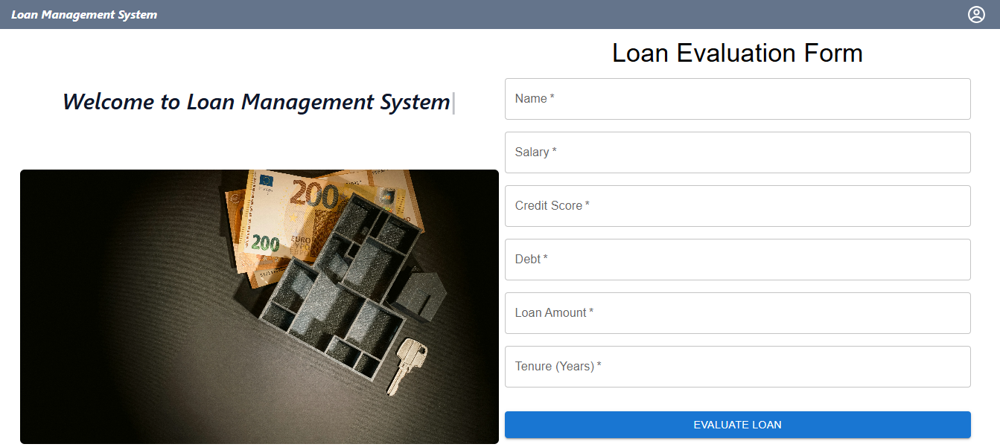

# **Loan Management System Expert System**

**Version:** 1.0  
**Date:** December 8, 2024  

---

## **Overview**


The **Loan Management System Expert System** is an intelligent solution designed to evaluate loan applications based on various financial and credit-related criteria. The system operates without a database and uses predefined rules to process user inputs, ensuring efficiency and simplicity. It includes a modern frontend interface for user interactions and a backend that implements expert decision-making logic.

---

## **Table of Contents**
1. [Features](#features)  
2. [System Architecture](#system-architecture)  
3. [Technologies Used](#technologies-used)  
4. [Setup Instructions](#setup-instructions)  
5. [API Documentation](#api-documentation)  
6. [Loan Evaluation Logic](#loan-evaluation-logic)  
7. [Frontend Design](#frontend-design)  
8. [Conclusion](#conclusion)  

---

## **Features**
- **Debt-to-Income Ratio Evaluation**: Rejects applications with DTI exceeding 40%.  
- **Credit Score Assessment**: Approves or rejects based on predefined credit score ranges.  
- **Interest Rate Recommendation**: Suggests interest rates based on creditworthiness.  
- **Salary Banding**: Classifies applicants into income tiers.  
- **Loan Tenure Validation**: Rejects loans with unreasonably long tenures (>10 years).  
- **Modern User Interface**: User-friendly frontend with validation and beautiful design.  

---

## **System Architecture**

### **Frontend**
- Developed using **React** and **Material-UI**.  
- Collects user inputs and displays results in real-time.  

### **Backend**
- Built with **Flask**.  
- Implements expert system rules to evaluate loan applications.  

### **Communication**
- The frontend communicates with the backend via a RESTful API (`POST` requests).  

---

## **Technologies Used**

### **Frontend**
- **React**: For building the user interface.  
- **Material-UI**: For enhanced styling and components.  

### **Backend**
- **Python (Flask)**: For implementing the expert system logic.  

### **Other Tools**
- **JSON**: For data exchange between frontend and backend.  

---

## **Setup Instructions**

### **Prerequisites**
- Node.js and npm installed for the frontend.  
- Python 3.x installed for the backend.  

### **Setup**
1. Clone the repository:  
   ```bash
   git clone https://github.com/kelvinmhacwilson/loan-management-system
   cd frontend
   ```
2. Install dependencies:  
   ```bash
   npm install
   ```
3. Start the frontend:  
   ```bash
   npm run dev
   ```
4. Change directory to backend:  
   ```bash
   cd backend
   ```
5. Install Flask:  
   ```bash
   pip install flask flask-cors
   ```
6. Run the backend:  
   ```bash
   python app.py
   ```

---

## **API Documentation**

### **Endpoint:** `/api/evaluate-loan`  
- **Method:** `POST`  
- **Description:** Evaluates loan eligibility based on input parameters.

#### **Request Body (JSON):**
```json
{
  "name": "John Doe",
  "salary": "40000",
  "creditScore": "750",
  "debt": "10000",
  "loanAmount": "15000",
  "tenure": "5"
}
```

#### **Response (JSON):**

**On Success:**
```json
{
  "status": "Approved: John Doe qualifies for the loan. Interest Rate: 7%. Salary Band: High Income. DTI: 25.00%."
}
```

**On Rejection:**
```json
{
  "status": "Rejected: High Debt-to-Income Ratio (45.00%) for John Doe."
}
```

---

## **Loan Evaluation Logic**

### **Rules Implemented**

1. **Debt-to-Income Ratio (DTI):**
   - **Formula:** `(Debt / Salary) * 100`
   - Rejected if DTI > 40%.

2. **Credit Score:**
   - Rejected if `creditScore < 600`.  
   - Interest rate assigned based on score:  
     - `600–700`: 10%.  
     - `>700`: 7%.

3. **Salary Banding:**
   - `<30,000`: Rejected for low income.  
   - `30,000–60,000`: Medium Income.  
   - `>60,000`: High Income.

4. **Loan Tenure:**
   - Rejected if `tenure > 10 years`.

5. **Approval:**
   - Loan is approved if all conditions are satisfied.

---

## **Frontend Design**

### **Features**
- **Validation**: Ensures all inputs are provided and numeric where applicable.  
- **Responsiveness**: Adjusts seamlessly to different devices.  
- **User Feedback**: Displays success or rejection messages clearly.  

### **UI Components**
1. **Form**:  
   - Inputs for name, salary, credit score, debt, loan amount, and tenure.  
2. **Button**:  
   - Submit button styled with Material-UI.  
3. **Alert**:  
   - Displays loan evaluation results.  


## **Conclusion**

The Loan Management System Expert System is a lightweight, efficient, and scalable solution for evaluating loan applications. Its clean architecture and user-friendly design make it ideal for small-scale financial evaluations, with room for future upgrades to meet enterprise needs.